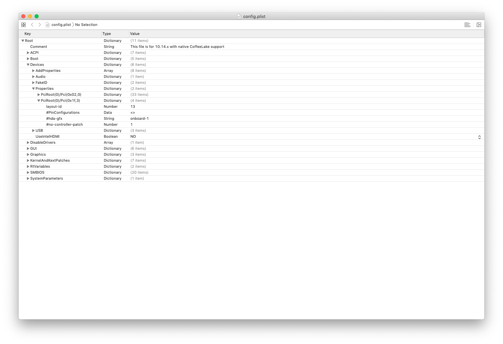

# Razer Blade 15 Base Model Hackintosh
Note: I'AM NOT RESPONSIBLE IF YOU MESS UP YOUR COMPUTER USING THIS GUIDE!

## Intro

First of all, you need to know that a some things will not work on macOS!

This repository contains all the necessary files that I used to Hackintosh my Razer Blade

This guide is based on [Razer Blade 15 Advanced 2019 by stonevil](https://github.com/stonevil/Razer_Blade_Advanced_early_2019_Hackintosh) and [Razer Blade 15 2018 by vettz500](https://www.tonymacx86.com/threads/guide-razer-blade-15-2018-detailed-install-guide-high-sierra-10-13-6-17g2208-17g5019.264017/) tutorials.

I will no explain you how to install macOS because there are a lot of tutorials to do it! I will only explain how to have maximum hardware working after macOS installation

## Hardware

### What works?

* Intel UHD Graphics 630 (with full hardware acceleration)
* Wifi and Bluetooth (after network card upgrade - Intel Wifi card is not compatible with macOS)
* Realtek Ethernet card
* Integrated speakers / mic (ALC256 codec)
* Battery status

### What doesn't work?

* Touchpad (You will need an USB mouse)
* Native Wifi / Bluetooth card (should be replaced)

## Fixes

### Audio

To fix audio, you will need [AppleALC](https://github.com/acidanthera/AppleALC) kext by [acidanthera](https://github.com/acidanthera)

You will need to change your Clover configuration :

Open the *config.plist* file with a plist editor like Xcode.



Uncomment the *layout-id* line (In Root > Devices > Properties > PciRoot(0)/Pci(0x1f,3) > layout-id) that is commented by default.

Then set *layout-id* to ``13``.

### Battery status

You will need to patch your DSDT to get battery status working.

#### Export ACPI

* Reboot computer
* In ``Clover Boot Menu`` press ``F2``
* Select normal macOS boot.

#### DSDT patching

* Mount your ``EFI`` partition using *Clover Configurator* or by typing ```sudo diskutil mount EFI``` in a Terminal
* Navigate to folder ``/Volumes/EFI/EFI/CLOVER/ACPI/``.
* Copy folder ``origin`` to ``Desktop`` folder.
