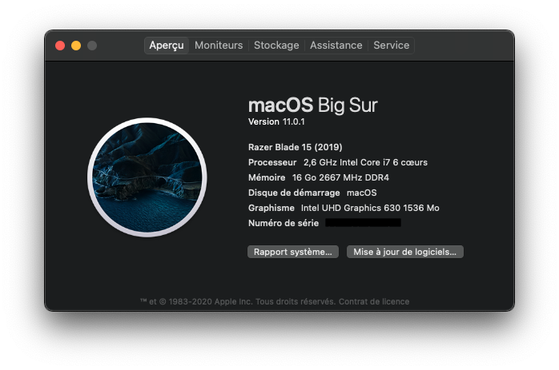
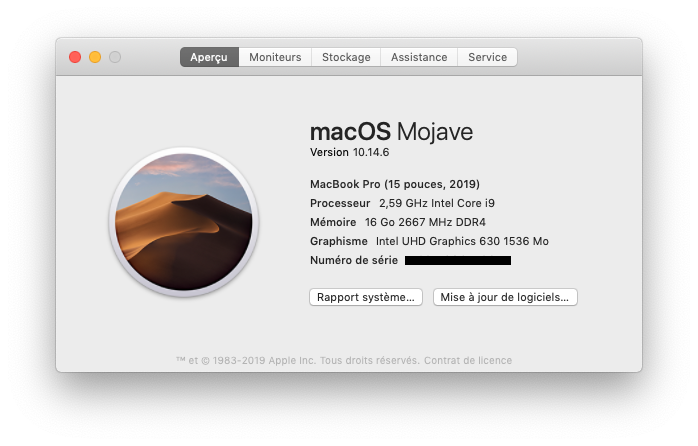
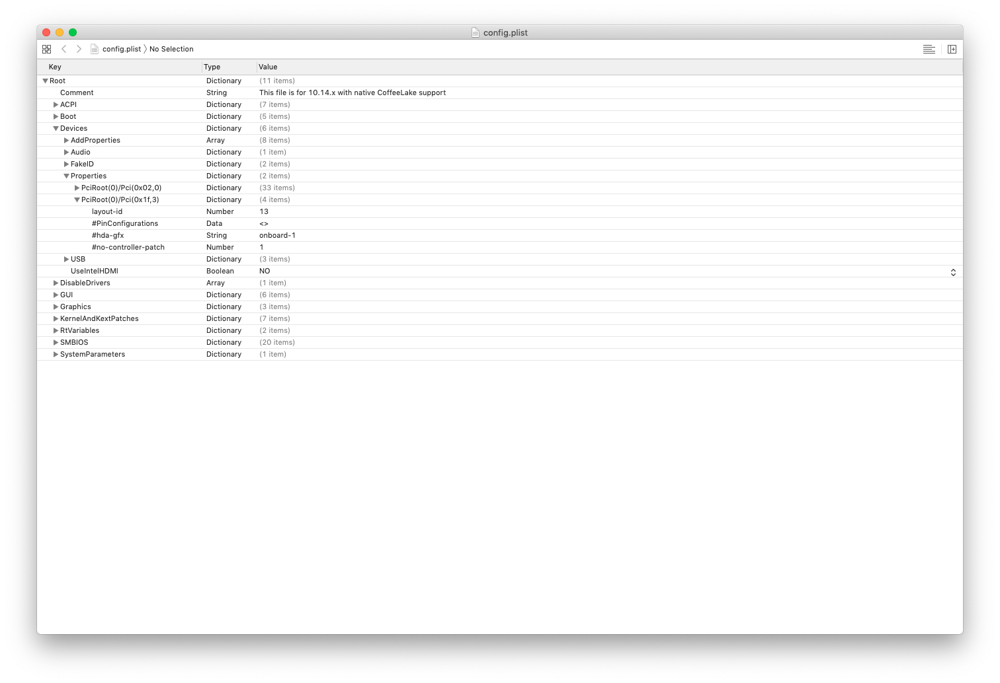
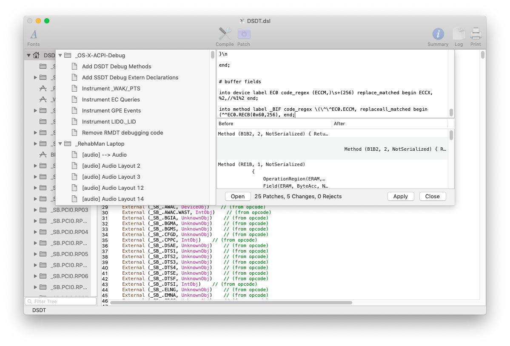
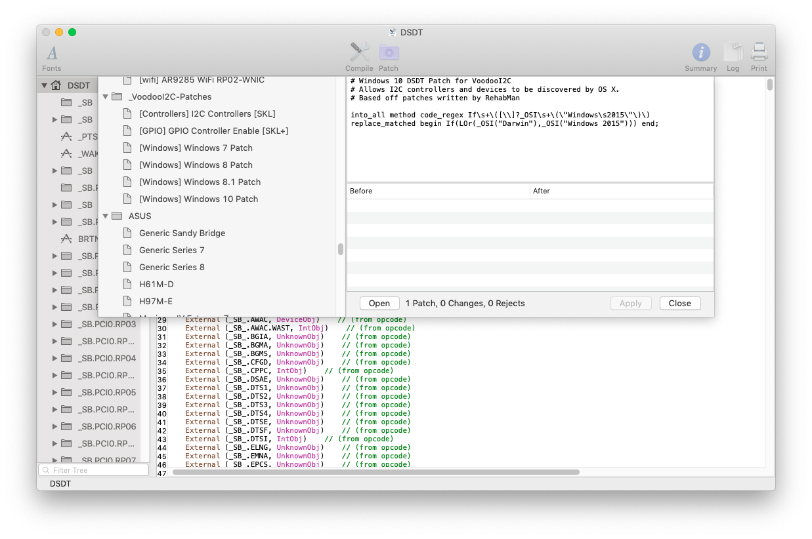
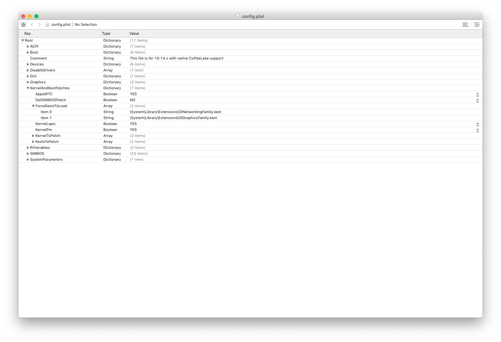
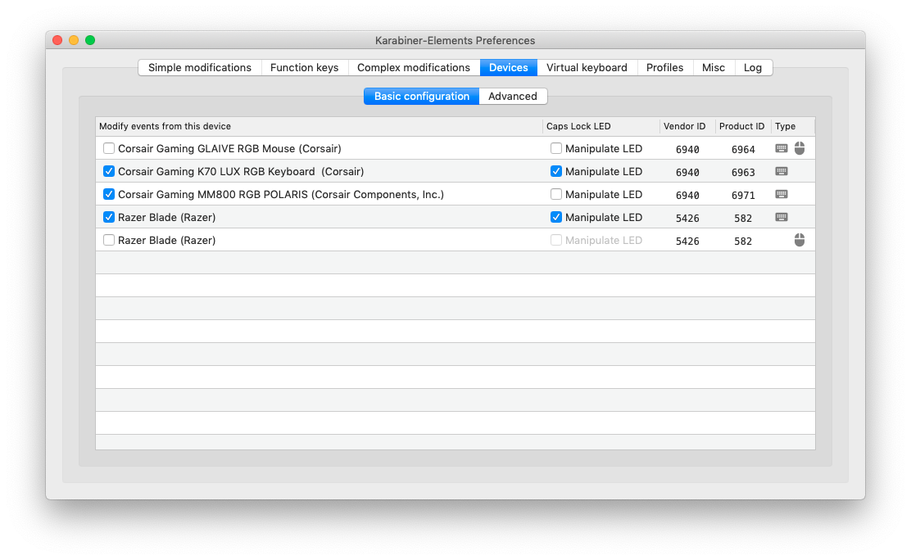

# Razer Blade 15 Base Model Hackintosh



## Intro

First of all, you need to know that a some things will not work on macOS!

This repository contains all the necessary files that I used to Hackintosh my Razer Blade

This EFI is based on [Razer Blade 15 Base Model 2019 Hackintosh by The Mysticle](https://www.youtube.com/watch?v=oxQU3IrGqCM) tutorial.

#### NEW VERSION
**The current CLOVER EFI folder is not compatible with Catalina and Big Sur! Also, it uses CLOVER. You can download the [EFI_OC](EFI_OC) folder which is a new EFI folder for macOS 10.15+ (cause it uses MacBookPro16,1 SMBIOS) that uses OpenCore, which will have better support for future macOS updates!**

**Also, there are no unnecessary patches on OpenCore because I only patched required SSDT, there is no DSDT patch like on CLOVER!**

I will not explain you how to install macOS because there are a lot of tutorials to do it! I will only explain how to have maximum hardware working after macOS installation

## Hardware

### What works?

* Intel UHD Graphics 630 (with full hardware acceleration using [WhateverGreen](https://github.com/acidanthera/WhateverGreen))
* Wifi and Bluetooth (using [itlwm](https://github.com/OpenIntelWireless/itlwm) and [IntelBluetoothFirmware](https://github.com/OpenIntelWireless/IntelBluetoothFirmware))
* Realtek Ethernet card (using [RealtekRTL8111](https://github.com/RehabMan/OS-X-Realtek-Network))
* Integrated speakers + mic and external speakers/headphones + mic on jack port (using [AppleALC](https://github.com/acidanthera/AppleALC) with layout-id ``21`` for ALC256 codec)
* Battery status (using [SMCBatteryManager](https://github.com/acidanthera/VirtualSMC))
* Integrated 720p Webcam
* Trackpad (with all gestures using [VoodooI2C](https://github.com/VoodooI2C/VoodooI2C))
* AirDrop and Apple Watch Unlock (After network card upgrade)

### What doesn't work?

* AirDrop and Apple Watch Unlock with native Intel card (should be replaced with a Broadcom one)
* NVIDIA GPU (No drivers for RTX 2060 / GTX 1660)
* HDMI / mDP / USB-C to HDMI (They are connected to the NVIDIA GPU - You can use an external USB display using [DisplayLink](https://www.displaylink.com/) technology or things like this)

## Fixes

### WiFi + Bluetooth

In my OpenCore EFI folder, I use AirportItlwm and IntelBluetoothFirmware for macOS Big Sur, if you use another macOS version, check [itlwm](https://github.com/OpenIntelWireless/itlwm) and [IntelBluetoothFirmware](https://github.com/OpenIntelWireless/IntelBluetoothFirmware) pages to see what you have to do. And, if you changed you WiFi / BT card, follow another tutorial like [AirPortBrcmFixup](https://github.com/acidanthera/AirPortBrcmFixup) one to get it working if needed.

### Audio

I use [AppleALC](https://github.com/acidanthera/AppleALC) with ``layout-id`` **21** to fix audio. If you want, you can see all the ``layout-ids`` I tried in [this file](layout-ids.md).

# Old guide



## Intro

First of all, you need to know that a some things will not work on macOS!

This repository contains all the necessary files that I used to Hackintosh my Razer Blade

This guide is based on [Razer Blade 15 Advanced 2019 by stonevil](https://github.com/stonevil/Razer_Blade_Advanced_early_2019_Hackintosh) and [Razer Blade 15 2018 by vettz500](https://www.tonymacx86.com/threads/guide-razer-blade-15-2018-detailed-install-guide-high-sierra-10-13-6-17g2208-17g5019.264017/) tutorials.

#### NEW VERSION
**The current CLOVER EFI folder is not compatible with Catalina and Big Sur! Also, it uses CLOVER. You can download the [EFI_OC](EFI_OC) folder which is a new EFI folder for macOS 10.15+ (cause it uses MacBookPro16,1 SMBIOS) that uses OpenCore, which will have better support for future macOS updates!**

I will not explain you how to install macOS because there are a lot of tutorials to do it! I will only explain how to have maximum hardware working after macOS installation

The basic config that I used is [config_UHD630.plist](https://github.com/RehabMan/OS-X-Clover-Laptop-Config/blob/master/config_UHD630.plist) by [RehabMan](https://github.com/RehabMan)

## Hardware

### What works?

* Intel UHD Graphics 630 (with full hardware acceleration using [WhateverGreen](https://github.com/acidanthera/WhateverGreen))
* Wifi and Bluetooth (using [itlwm](https://github.com/OpenIntelWireless/itlwm) and [IntelBluetoothFirmware](https://github.com/OpenIntelWireless/IntelBluetoothFirmware))
* Realtek Ethernet card (using [RealtekRTL8111](https://github.com/RehabMan/OS-X-Realtek-Network))
* Integrated speakers + mic and external speakers/headphones + mic on jack port (using [AppleALC](https://github.com/acidanthera/AppleALC) with layout-id ``21`` for ALC256 codec)
* Battery status (using [SMCBatteryManager](https://github.com/acidanthera/VirtualSMC))
* Integrated 720p Webcam
* Trackpad (with all gestures using [VoodooI2C](https://github.com/VoodooI2C/VoodooI2C))
* AirDrop and Apple Watch Unlock (After network card upgrade)

### What doesn't work?

* AirDrop and Apple Watch Unlock with native Intel card (should be replaced with a Broadcom one)
* NVIDIA GPU (No drivers for RTX 2060 / GTX 1660)
* HDMI / mDP / USB-C to HDMI (They are connected to the NVIDIA GPU - You can use an external USB display using [DisplayLink](https://www.displaylink.com/) technology or things like this)

# Old guide

## Fixes

### Audio

To fix audio, you will need [AppleALC](https://github.com/acidanthera/AppleALC) kext by [acidanthera](https://github.com/acidanthera)

You will need to change your Clover configuration :

Open the *config.plist* file with a plist editor like Xcode.



Uncomment the *layout-id* line (In Root > Devices > Properties > PciRoot(0)/Pci(0x1f,3) > layout-id) that is commented by default.

Then set *layout-id* to ``21``.

### Battery status

You will need to patch your DSDT to get battery status working.

#### Export ACPI

* Reboot computer
* In ``Clover Boot Menu`` press ``F2``
* Select normal macOS boot.

#### DSDT patching

* Mount your ``EFI`` partition using *Clover Configurator* or by typing in a Terminal
```
sudo diskutil mount EFI
```
* Navigate to folder ``/Volumes/EFI/EFI/CLOVER/ACPI/``.
* Copy folder ``origin`` to ``Desktop`` folder.
* Download ``MaciASL`` and copy it to ``/Applications/``.
* Download ``iasl``.
* Unzip ``iasl.zip`` if required.
* Copy ``iasl`` from ``~/Downloads/`` folder to ``/usr/bin/`` folder with command in ``Terminal`` application.
```
sudo cp ~/Downloads/iasl /usr/bin/
rm ~/Downloads/iasl
```
* Navigate to ``~/Desktop/origin/`` folder in ``Terminal`` application with command ``cd ~/Desktop/origin/``.
* Disassembling ``.aml`` files with command in ``Terminal`` application
```
iasl -da -dl DSDT.aml SSDT*.aml
```
#### Old method (please use the [new method](#new-method))
* Run ``MaciASL`` application and open file ``~/Desktop/origin/DSDT.dsl``.
* Click ``Patch`` button in toolbar.

* Copy this patch in the ``Patch`` window:
```
into method label B1B2 remove_entry;

into definitionblock code_regex . insert

begin

Method (B1B2, 2, NotSerialized) { Return(Or(Arg0, ShiftLeft(Arg1, 8))) }\n

end;


into device label EC0 code_regex BIF1,\s+16, replace_matched begin IF10,8,IF11,8, end;

into device label EC0 code_regex BIF2,\s+16, replace_matched begin IF20,8,IF21,8, end;

into device label EC0 code_regex BIF3,\s+16, replace_matched begin IF30,8,IF31,8, end;

into device label EC0 code_regex BIF4,\s+16, replace_matched begin IF40,8,IF41,8, end;


into device label EC0 code_regex BST0,\s+16, replace_matched begin ST00,8,ST01,8, end;

into device label EC0 code_regex BST1,\s+16, replace_matched begin ST10,8,ST11,8, end;

into device label EC0 code_regex BST2,\s+16, replace_matched begin ST20,8,ST21,8, end;

into device label EC0 code_regex BST3,\s+16, replace_matched begin ST30,8,ST31,8, end;


into method label _BIF code_regex \^\^EC0\.BIF1, replaceall_matched begin B1B2(^^EC0.IF10,^^EC0.IF11), end;

into method label _BIF code_regex \^\^EC0\.BIF2, replaceall_matched begin B1B2(^^EC0.IF20,^^EC0.IF21), end;

into method label _BIF code_regex \^\^EC0\.BIF3, replaceall_matched begin B1B2(^^EC0.IF30,^^EC0.IF31), end;

into method label _BIF code_regex \^\^EC0\.BIF4, replaceall_matched begin B1B2(^^EC0.IF40,^^EC0.IF41), end;


into method label _BST code_regex \^\^EC0\.BST0, replaceall_matched begin B1B2(^^EC0.ST00,^^EC0.ST01), end;

into method label _BST code_regex \^\^EC0\.BST1, replaceall_matched begin B1B2(^^EC0.ST10,^^EC0.ST11), end;

into method label _BST code_regex \^\^EC0\.BST2, replaceall_matched begin B1B2(^^EC0.ST20,^^EC0.ST21), end;

into method label _BST code_regex \^\^EC0\.BST3, replaceall_matched begin B1B2(^^EC0.ST30,^^EC0.ST31), end;


# added for Razer Blade 15 (2018), per JomanJi

into device label EC0 code_regex BIF0,\s+16, replace_matched begin IF00,8,IF01,8, end;

into method label _BIF code_regex \(\^\^EC0.BIF0, replaceall_matched begin (B1B2(\^\^EC0.IF00,\^\^EC0.IF01), end;


# utility methods to read/write buffers from/to EC

into method label RE1B parent_label EC0 remove_entry;

into method label RECB parent_label EC0 remove_entry;

into device label EC0 insert

begin

Method (RE1B, 1, NotSerialized)\n

{\n

OperationRegion(ERAM, EmbeddedControl, Arg0, 1)\n

Field(ERAM, ByteAcc, NoLock, Preserve) { BYTE, 8 }\n

Return(BYTE)\n

}\n

Method (RECB, 2, Serialized)\n

// Arg0 - offset in bytes from zero-based EC\n

// Arg1 - size of buffer in bits\n

{\n

ShiftRight(Add(Arg1,7), 3, Arg1)\n

Name(TEMP, Buffer(Arg1) { })\n

Add(Arg0, Arg1, Arg1)\n

Store(0, Local0)\n

While (LLess(Arg0, Arg1))\n

{\n

Store(RE1B(Arg0), Index(TEMP, Local0))\n

Increment(Arg0)\n

Increment(Local0)\n

}\n

Return(TEMP)\n

}\n

end;


# buffer fields

into device label EC0 code_regex (ECCM,)\s+(256) replace_matched begin ECCX,%2,//%1%2 end;

into method label _BIF code_regex \(\^\^EC0.ECCM, replaceall_matched begin (^^EC0.RECB(0x60,256), end;
```
* Apply the ``Patch``
* Save the file as *ACPI Machine Language Binary*
* Copy your new ``DSDT.aml`` to ``/Volumes/EFI/EFI/CLOVER/ACPI/patched/``
* Copy the [ACPIBatteryManager](https://bitbucket.org/RehabMan/os-x-acpi-battery-driver/downloads/) kext to ``/Volumes/EFI/EFI/CLOVER/kexts/Other``.
* That's done, now reboot and it will work!

#### New Method

Sometimes, the ``ACPIBatteryManager`` can cause bugs! I suggest you to replace it by [VirtualSMC](https://github.com/acidanthera/VirtualSMC/releases) and its ``SMCBatteryManager`` extension.
* Remove ``ACPIBatteryManager.kext`` if you have it.
* Put ``VirtualSMC`` and ``SMCBatteryManager`` kexts in your kexts folder.
* Open your DSDT file with MaciASL
* Click ``Patch`` button in toolbar.
* Now navigate and select Razer Blade (2014) in the patches list.
* Click on ``Apply``
* Close the ``Patch`` window.
* Save the file as *ACPI Machine Language Binary*
* Copy your new ``DSDT.aml`` to ``/Volumes/EFI/EFI/CLOVER/ACPI/patched/``
* That's done, now reboot and it will work!

### Wifi / Bluetooth (After upgrading network card)

* Just download [AirPortBrcmFixup](https://github.com/acidanthera/airportbrcmfixup/releases) and [BrcmPatchRAM](https://github.com/acidanthera/BrcmPatchRAM/releases)
* Then copy ``AirPortBrcmFixup``, ``BrcmFirmwareData``, ``BrcmNonPatchRAM2`` and ``BrcmPatchRAM2`` kexts to ``/Volumes/EFI/EFI/CLOVER/kexts/Other/``.
* Now reboot and if you have a compatible network card Wifi and Bluetooth will work!
* **DON'T DO THIS IF YOU DON'T HAVE UPGRADED YOUR WIFI/BLUETOOTH CARD!!!**

### Integrated graphics

* Download [Lilu](https://github.com/acidanthera/Lilu/releases) and [WhateverGreen](https://github.com/acidanthera/WhateverGreen/releases) kexts.
* Copy them in ``/Volumes/EFI/EFI/CLOVER/kexts/Other/``.
* Now reboot and Full graphics acceleration will work

### Ethernet

* Download [RealtekRTL8111](https://bitbucket.org/RehabMan/os-x-realtek-network/downloads/) kext.
* Place it in ``/Volumes/EFI/EFI/CLOVER/kexts/Other/``.
* Now reboot and Ethernet will work

### Trackpad

* Download [VoodooI2C](https://github.com/alexandred/VoodooI2C/releases) kext.
* Place ``VoodooI2C`` and ``VoodooI2CHID`` in ``/Volumes/EFI/EFI/CLOVER/kexts/Other/``.
* Open your DSDT file in MaciASL
* Click ``Patch`` button in toolbar.

* Select the ``[Windows] Windows 10 Patch`` in ``_VoodooI2C-Patches``
* Click ``Apply``
* Then copy this patch in the ``Patch`` window:
```
into method label _STA parent_label GPI0 replace_content begin

Return (0x0F)

end;
```
* Then find this code in ``Device (TPD0)`` in ``Scope (_SB.PCI0.I2C1)``:
```
Name (SBFG, ResourceTemplate ()
   {
       GpioInt (Level, ActiveLow, ExclusiveAndWake, PullDefault, 0x0000,
           "\\_SB.PCI0.GPI0", 0x00, ResourceConsumer, ,
           )
           {   // Pin list
               0x0000
           }
   })
```
* And replace by this:
```
Name (SBFG, ResourceTemplate ()
   {
       GpioInt (Level, ActiveLow, ExclusiveAndWake, PullDefault, 0x0000,
           "\\_SB.PCI0.GPI0", 0x00, ResourceConsumer, ,
           )
           {   // Pin list
               0x00A2
           }
   })
```
* Then close the ``Patch`` window
* Save the file as *ACPI Machine Language Binary*
* Copy your new ``DSDT.aml`` to ``/Volumes/EFI/EFI/CLOVER/ACPI/patched/``
* Now open your CLOVER ``config.plist`` file with a plist editor like ``Xcode``
* Go to ``Kernel and Kexts patches`` > ``ForceKextsToLoad``
* Add a string with value ``\System\Library\Extensions\IOGraphicsFamily.kext``

* Now reboot and the trackpad will fully work

### Caps Lock light

* Install [Karabiner-Elements](https://pqrs.org/osx/karabiner/)
* Enable ``Manipulate LED`` for ``Razer Blade (Razer)`` in ``Devices`` section


### Keyboard backlight control

There are two ways to control your Razer Keyboard. You can use the [command line tool](#command-line-tool) or the [app](#gui)

#### GUI

* You can use the [Razer macOS](https://github.com/1kc/razer-macos) app by 1kc that allow you to change your Razer Keyboard color from the taskbar
* Just download [it](Tools/Razer-macOS.dmg) and put it in your ``/Applications`` folder.

#### Command Line Tool
* Just download my fork of [osx-razer-blade](https://github.com/DocSystem/osx-razer-blade) if you want to compile it with Xcode or just use the command line tool: [osx-razer-led](https://github.com/DocSystem/osx-razer-led)
* For example, if you want the keyboard to be white and stay static, just type:
```
osx-razer-led static white
```

### iMessage / FaceTime

To enable iMessage and FaceTime you can follow this [guide](https://www.tonymacx86.com/threads/an-idiots-guide-to-imessage.196827/)
